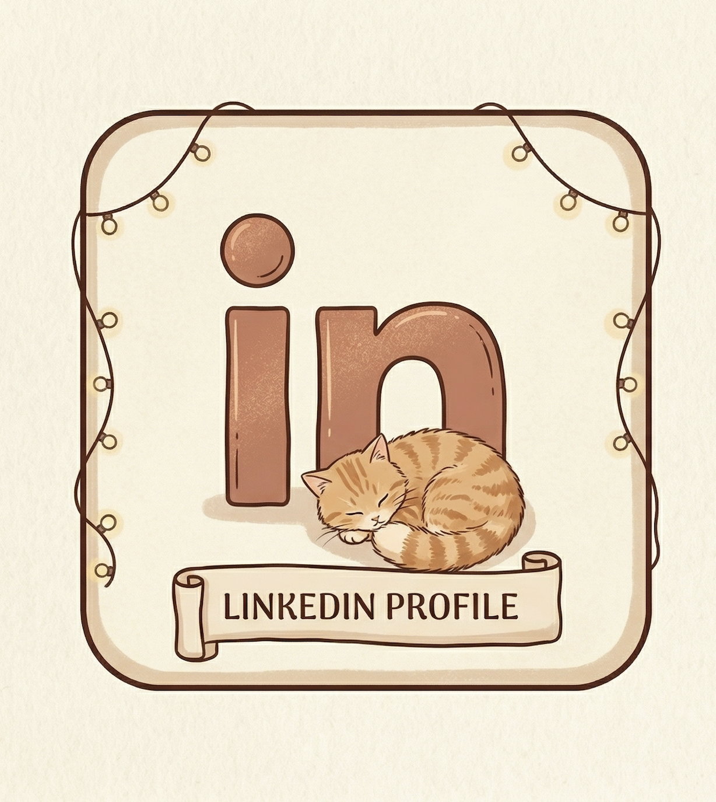

<h1 align="center">Hi, I’m Tahseen! </h1>

  
  &nbsp;&nbsp;
  

<h3 align="center">I work with Linux, develop automation tools in Python, and focus on system reliability, 
  scalability, and performance.
</h3>

  

- All of my projects are available at: https://ahmadtahseen.ie/
- How to reach me: **Ahmtahseen4@gmail.com**

<h3 align="left">Connect with me</h3>

  
  

<h3 align="left" style="font-size: 24px;">GitHub Stats</h3>

  
  

<h3 align="left" style="font-size: 24px;">Languages and Tools</h3>

  
  
  
  
  
  
  
  
  
  
  
  
  
  
  
  
  
  
  
  
  

