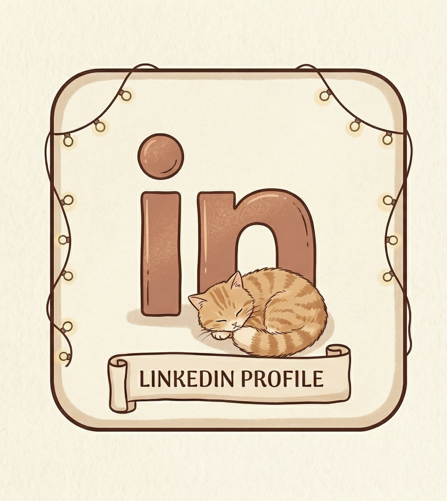

<h1 align="center">Hi, I’m Tahseen! </h1>

<!--

  
  &nbsp;&nbsp;
  

-->

<h3 align="center">
I work with Linux, develop automation tools in Python, and focus on system reliability, 
scalability, and performance.
</h3>

  

- All of my projects are available at: https://ahmadtahseen.ie/  
- How to reach me: **Ahmtahseen4@gmail.com**
